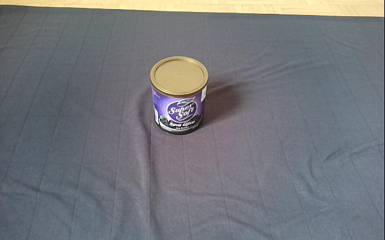
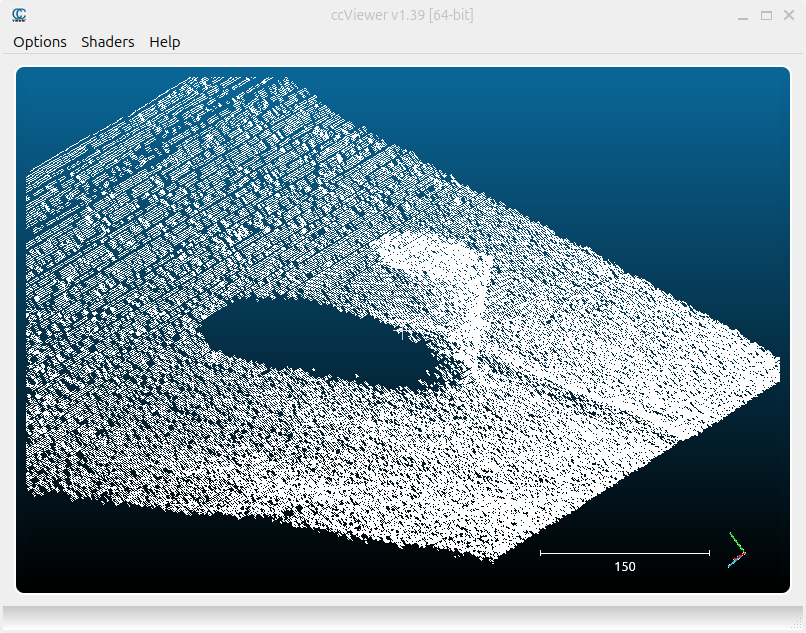
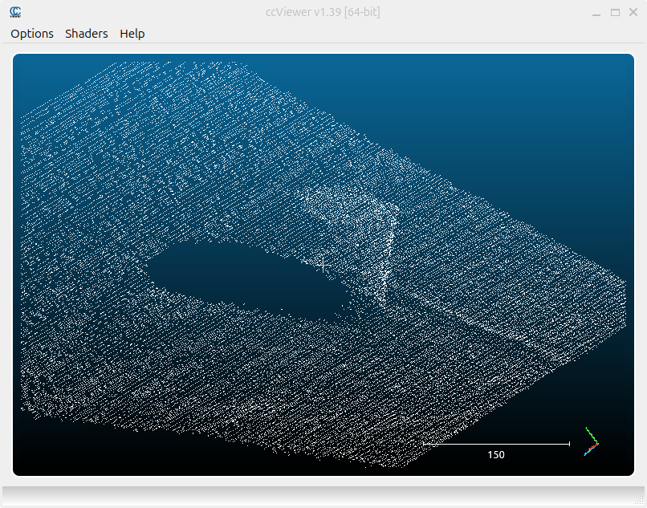
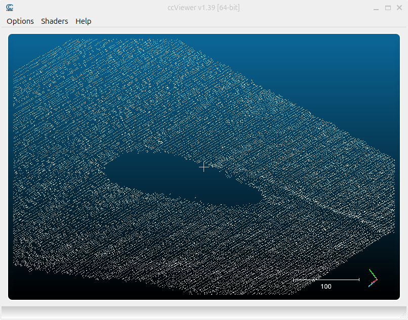
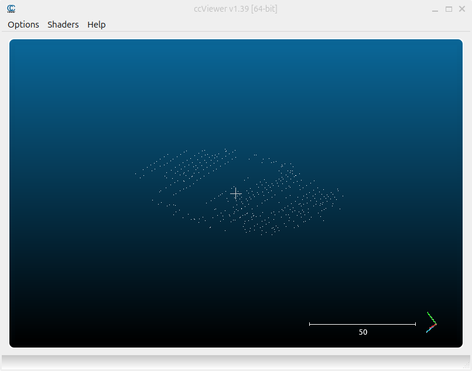
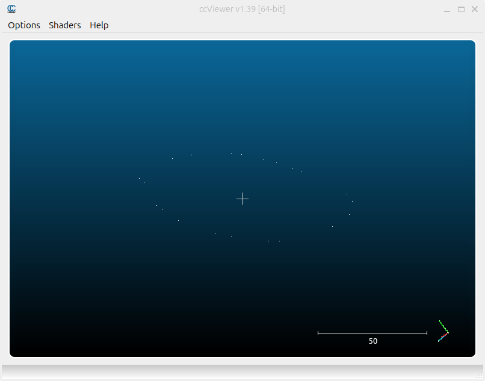

# Cylinder Dimensions Measurement

## Software and hardware used:
- Luxonis' DepthAI v3 (https://github.com/luxonis/depthai-core/tree/v3_develop) and Luxonis' Oak D PRO stereo depth camera
- OpenCV v4.6.
- Point Cloud Library v1.14.0

&nbsp;
---

## Project steps:
### 1. Setup:
- Cloned, built and installed DepthAI v3 
- Installed other dependencies used, such as OpenCV, Open3D, Point Cloud Library
- CMake project setup

### 2. Saving a point cloud to a file using DepthAI and Oak camera:
- Expanded the visualizer_rgbd.cpp example (provided in the DepthAI examples folder) with the functionality of saving a
pointcloud to a file with a corresponding color image, by pressing a keyboard button
- Created a dataset of point cloud examples for three different cylinders, recorded from different angles 
(stored in the data folder of the repository)

### 3. Cylinder segmentation and measurement:
- Developed the cylinder segmentation and measurement algorithm, using stored point clouds as inputs for 
quicker testing and development
- Development of a real time segmentation and measurement application, with cylinder dimensions being 
displayed in the camera stream
- PCL library is used for most operations concerning point clouds

### 4. Finishing touches 
- Minor optimizations, code cleanup, writing of the report

&nbsp;
---

## Approach used:
### 1. Filtering and downsampling the input cloud:
- Start by filtering the points that are too distant, in my case I have chosen 1 meter as the cut off distance
- Downsample the points with a voxel grid. This reduces the number of points while keeping enough information about
 the input cloud

### 2. Determine the normals, used for segmentation:
- The normals are used in the segmentation process, where their weight is determined as a parameter

### 3. Find the ground plane:
- Ransac is used to find the ground plane. I have used a distance threshold of 4-5mm to ensure that most of the time, 
all of the points which are a part of the ground plane are found. As most of the points in the filtered point 
cloud belong to the ground plane, I use ransac with a low number of iterations. This speeds up the process, while still
 ensuring quality results
- The coefficients of the ground plane are determined and the points belonging to it are removed from the pointcloud

### 4. Determine the parallel plane:
- Another ransac method is used on the point cloud's remaining points. This time we are looking for a parallel plane (the
 top of the cylinder)
- This time the number of iterations is much greater, while the distance threshold for points is much lower. This
 contributes to a much more precise selection of points, which is important for later measurements

### 5. Measuring the dimensions of the cylinder:
- The precise height of the cylinder is determined by calculating the average perpendicular distance of the points 
that make up the top of the cylinder to the ground plane
- To determine the radius of the cylinder we first calculate the convex hull of the top of the cylinder.
This determines the polygon which fully and tightly encloses the points in the top of the cloud. 
The points of this polygon approximating the boundary of the top of the cylinder and can be used to determine the radius
- This is done by finding the maximum distance between pairs of these points - the diameter

### 6. Filtering the measured values:
-

&nbsp;
---

## Example:
- Here is an example of the used approach. First image represents the color image of the object recorded.
This is followed by the point cloud generated using DepthAI and Luxonis' Oak D PRO stereo depth camera. The next 
image represents the input point cloud after filtering and downsampling. The result of ground plane segmentation is next, 
which results in a ground plane point cloud and the cylinder point cloud. Finally the top plane of the cylinder and its 
point cloud after applying a convex hull are shown in the bottom two images.

&nbsp;

&nbsp;

- Here is an example of the real time cylinder dimensions measurement:

&nbsp;
---

## Results, challenges and possible improvements:
- Results are ...
- To achieve a more robust cylinder segmentation use NN
- What about multiple cylinders? Limitations?

- Challenges with the shapes