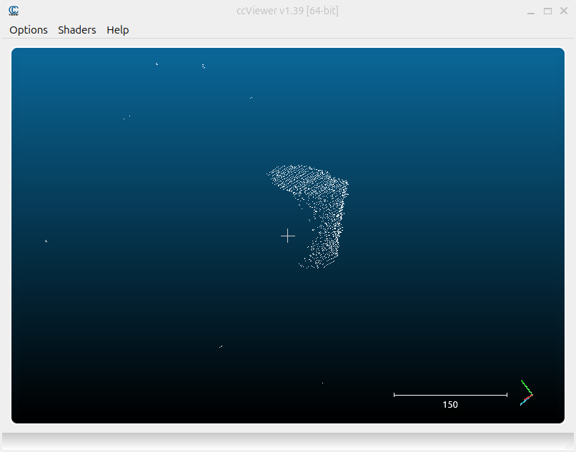

# Cylinder Dimensions Measurement

## Software and Hardware Used:
- Luxonis' DepthAI v3 (https://github.com/luxonis/depthai-core/tree/v3_develop) and Luxonis' Oak D PRO stereo depth camera
- OpenCV v4.6
- Point Cloud Library v1.14.0

&nbsp;
---

## Project Overview:
### 1. Environment Setup:
- Cloned, built and installed DepthAI v3.
- Installed other dependencies, such as OpenCV, Open3D and the Point Cloud Library.
- Configured the project using CMake.

### 2. Point Cloud Capturing and Saving:
- Extended the visualizer_rgbd.cpp example from the DepthAI examples with the functionality of capturing and
saving point clouds to a file with the corresponding color image, by pressing a keyboard button.
- Collected a dataset consisting of point clouds for three different cylinders, recorded from multiple angles
and stored in the project’s data directory.

### 3. Cylinder Segmentation and Measurement:
- Developed a cylinder segmentation and measurement algorithm, using stored point clouds as inputs for 
quicker testing and development.
- Development of a real time segmentation and measurement application, with cylinder dimensions being 
displayed in the camera feed.
- Utilized the PCL library for core point cloud processing operations.

### 4. Finishing Touches:
- Minor optimizations, code cleanup, documentation of the project.

&nbsp;
---

## Approach Used:
### 1. Filtering and Downsampling the Input Cloud:
- Points beyond a specified range are filtered out. In this case,
a cutoff distance of 1 meter was used.
- The point cloud is downsampled using a voxel grid, which reduces the number of points while preserving
the overall structure and geometry necessary for accurate analysis.

### 2. Normal Estimation:
- Surface normals are estimated for each point in the cloud. These normals are essential for the later
RANSAC-based segmentation steps, with their influence adjustable via a weight parameter.

### 3. Ground Plane Detection:
- The ground plane is extracted using the RANSAC (Random Sample Consensus) algorithm. A distance threshold of 4–5 mm
is used to ensure that most of the points which are the ground plane inliers are found.
- Given that most of the input cloud's points lie on the ground, a low number of iterations is sufficient to find
the ground plane, which speeds up processing without sacrificing accuracy.
- Once done, both the plane coefficients and the corresponding inlier points are extracted. The ground plane points are then removed from the point cloud to isolate objects of interest.

### 4. Detection of the Top Plane (Parallel to Ground):
- A second RANSAC is applied to the remaining points to detect the top plane of the cylinder, assumed
to be roughly parallel to the ground.
- This step uses a higher iteration count and a smaller distance threshold. This
 contributes to a much more precise selection of points, which is important for later measurements

### 5. Cylinder Dimension Measurement:
- Height is calculated as the average perpendicular distance from the points on the top plane to the
previously detected ground plane.
- To determine the radius of the cylinder, the top plane points are used to compute their convex hull, forming
a tight 2D boundary. This determines the polygon which fully encloses the points of the top of the cloud. 
- The maximum distance between any two points on the convex hull is used to estimate the diameter of the
cylinder, from which the radius is derived.

### 6. Real-Time Measurement Filtering:
- To ensure measurement stability in real-time applications, a median filter is applied to the computed dimensions.
- This filter uses the median of the last n measurements, effectively removing outliers or spikes
caused by noise or segmentation errors.
- This approach ensures smooth, reliable readings frame-to-frame.

&nbsp;
---

## Example:
- Here is an example of how the used approach works. The first image represents the color image of the
object which was recorded.
- This is followed by the corresponding point cloud captured using DepthAI and Luxonis' Oak D PRO stereo depth camera.
- The next image represents the input point cloud after filtering and downsampling.
- The result of the ground plane segmentation is next, which results in a ground plane point cloud and the
cylinder point cloud.
- Finally the top plane of the cylinder and the point cloud representing its convex hull
are shown in the bottom two images.

&nbsp;

  

    
    

    
    

    
    

&nbsp;

- Here is an example of the real-time cylinder measurement:

  

&nbsp;
---

## Results, Limitations and Possible Improvements:
### Results:
- The algorithm achieves high accuracy, with measurement errors typically within ±2 millimeters under static
and controlled conditions.
- Performance (frames per second) is directly affected by the size of the point cloud. Smaller clouds such as
those generated when capturing from a closer distance result in higher FPS. Because of this, it is important
to note, that the FPS in the example above could be greatly improved if the internal configuration of the camera
(range threshold filtering) would be set. Such filtering is usually used when the region of interest is known
and fixed and can significantly reduce point cloud size and improve performance.
- The results can vary slightly due to the imperfect nature of the tested objects (such as an uneven 
top plane, raised edges which are higher than the actual top plane or a top which is wider than the rest of 
the cylinder).

### Limitations:
- The current implementation is limited to detecting a single cylinder placed on a flat surface.

### Possible Improvements:
- Multi cylinder detection could be enabled by introducing a neural network based segmentation step. This could
identify and separate regions of interest, allowing the current approach to be applied to each region
individually. Such segmentation step could provide a more robust segmentation even in single cylinder situations.
- Improving the presentation by adding bounding boxes of the detected cylinders on the video
feed, as well as updating the look of the resulting measurements.
